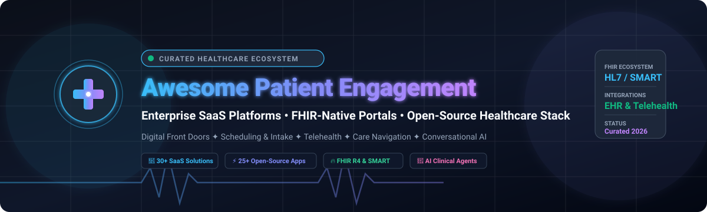

<p align="center">
  
</p>

# 🏥 Awesome Patient Engagement Platform [](https://github.com/ishandutta2007/Awesome-Awesome-Awesome)

<p align="center">
  <a href="https://github.com/ishandutta2007/Awesome-Awesome-Awesome"></a><a href="https://discord.gg/jc4xtF58Ve"></a><a href="https://github.com/ishandutta2007/Awesome-Patient-Engagement-Platform/stargazers"></a><a href="https://github.com/ishandutta2007/Awesome-Patient-Engagement-Platform/network/members"></a><a href="https://github.com/ishandutta2007/Awesome-Patient-Engagement-Platform/issues"></a><a href="https://makeapullrequest.com"></a><a href="https://github.com/ishandutta2007"></a>
</p>

---

## 🌟 Overview & Ecosystem

> **A curated directory of leading SaaS patient engagement platforms, open-source FHIR-native patient portals, digital front door suites, telehealth infrastructure, conversational healthcare AI, and healthcare interoperability toolkits.**

Modern **Patient Engagement Platforms (PEPs)** empower healthcare systems, ambulatory practices, and digital health startups to streamline every touchpoint of the patient journey:
- 🚪 **Digital Front Door & Discovery:** Provider directories, intelligent search, digital check-in, and SEO-optimized booking.
- 📋 **Automated Intake & Paperwork:** Electronic forms, insurance eligibility checks, ID verification, and clinical screeners.
- 💬 **Omnichannel Communications:** Two-way HIPAA-compliant SMS, secure email, automated appointment reminders, and voice calling.
- 💳 **Patient Financial Experience:** Accurate price estimations, transparent digital billing, online payment plans, and copay collection.
- 🩺 **Virtual Care & Remote Monitoring:** Telehealth video sessions, asynchronous chat, RPM device feeds, and care navigation.
- 🤖 **Clinical Conversational AI:** Generative AI agents for automated triage, symptom checking, FAQ deflection, and scheduling.
- 🔄 **FHIR & EHR Interoperability:** Deep real-time synchronization with Epic, Cerner/Oracle Health, MEDITECH, Athenahealth, eClinicalWorks, and OpenEMR via HL7 FHIR R4 and SMART on FHIR.

---

## 📑 Table of Contents

- [🏢 SaaS / Hosted Platforms](#-saashosted-platforms)
- [🌐 Open-Source GitHub Projects](#-open-source-github-projects)
- [🏗️ Composable Architecture & Blueprints](#️-composable-architecture--blueprints)
- [🤝 How to Contribute](#-how-to-contribute)
- [⭐ Star History](#-star-history)
- [📜 Disclaimer](#-disclaimer)

---

## 🏢 SaaS/Hosted Platforms

The following enterprise platforms offer turnkey, hosted patient engagement solutions. Ranked in descending order by company valuation, market capitalization, or reported revenue scale:

| 🏥 Product | 📝 Description | 📈 Valuation / Scale | 💰 Starting Pricing | 🎁 Free Tier / Trial Limits |
| :--- | :--- | :--- | :--- | :--- |
| **[Cedar](https://www.cedar.com/)** | Patient financial engagement platform specializing in billing transparency, personalized payment options, and pre-visit cost estimates. | **~$3.2B Valuation** ($350M+ funding) | ~$5,000/month (or ~1.5%–2.5% of digital collections + platform base fee) | ❌ No ongoing free tier; provides custom billing flow simulation demo and financial ROI evaluation |
| **[Phreesia](https://www.phreesia.com/)** | End-to-end patient intake, digital registration, scheduling, screening tools, and revenue cycle management. | **~$1.6B Market Cap** (~$410M+ ARR; NYSE: PHR) | ~$250/month (base subscription; scales to $800+/month based on modules and volume) | ❌ No ongoing free tier; offers free interactive live demo and promotional free access campaigns for qualifying practices |
| **[Phreesia Mobile](https://www.phreesia.com/platform/)** | Mobile-first zero-contact patient check-in, clinical intake questionnaires, and digital payment workflows. | **~$1.6B Market Cap** (Phreesia suite; NYSE: PHR) | ~$250/month (included with core Phreesia intake subscription tier) | ❌ No ongoing free tier; promotional full-platform access through select vendor campaigns or live demo |
| **[NexHealth](https://www.nexhealth.com/)** | Real-time EHR-integrated online booking, automated reminder sequences, custom digital forms, and review generation. | **~$1.0B Valuation** ($125M+ funding) | $299–$350/location/month (Starter tier with real-time online scheduling, reminder SMS, and forms) | ❌ No ongoing free tier; offers 30-day money-back guarantee period on select plans and live 1-on-1 demo |
| **[Notable](https://www.notablehealth.com/)** | AI-driven workflow automation platform that unifies patient scheduling, check-in, clinical intake, and pre-authorizations. | **~$1.0B Valuation** ($100M+ Series B) | ~$3,500/month (base automation digital assistant tier for clinic groups; scales with volume) | ❌ No ongoing free tier; offers guided workflow automation demo and clinical staff time-savings audit |
| **[Notable Patient Access](https://www.notablehealth.com/)** | Specialized digital front-door module for automated patient onboarding, scheduling, and EHR registration. | **~$1.0B Valuation** (Notable suite) | ~$3,500/month (base intelligent scheduling and intake automation module) | ❌ No ongoing free tier; provides clinical ROI assessment and custom digital assistant workflow demonstration |
| **[Tebra](https://www.tebra.com/)** | Complete practice operations platform uniting Kareo and PatientPop for patient acquisition, telehealth, billing, and care delivery. | **~$1.0B Valuation** (~$170M+ ARR) | $99–$399/provider/month (depending on tier: Engage, Practice EHR, or Full Billing suite) | ❌ No ongoing free tier; offers personalized live demo and practice growth evaluation |
| **[Kyruus Health](https://kyruushealth.com/)** | Enterprise provider directory, smart search, and scheduling engine connecting health plans and health systems with patients. | **~$1.0B Valuation** (Acquired by RevSpring; $150M+ raised) | $4,166/month ($50,000/year starting tier for Kyruus Connect; scales with provider count) | ❌ No ongoing free tier; offers live scheduled product demo and provider directory audit for health systems |
| **[Kyruus ProviderMatch](https://kyruushealth.com/)** | Provider search and match solution helping patients discover the exact in-network specialist according to clinical criteria. | **~$1.0B Valuation** (Kyruus suite) | $4,166/month ($50,000/year enterprise base for search & scheduling directory modules) | ❌ No ongoing free tier; offers customized enterprise provider-matching simulation and live demo |
| **[Weave](https://www.getweave.com/)** | All-in-one patient communications platform offering VoIP phone systems, two-way texting, online scheduling, and payment links. | **~$800M Market Cap** (~$200M+ ARR; NYSE: WEAV) | $199/month (base phone and messaging package; comprehensive bundles range $399–$599/month) | ❌ No ongoing free tier; provides free live interactive demo and practice communication workflow audit |
| **[Health Catalyst](https://www.healthcatalyst.com/)** | Clinical data analytics, population health management, and patient care management for health systems. | **~$700M Market Cap** (~$310M+ ARR; NASDAQ: HCAT) | ~$8,333/month (~$100,000/year enterprise base for DOS platform and analytics applications) | ❌ No ongoing free tier; offers consultative platform demonstration and healthcare data opportunity assessment |
| **[Artera](https://artera.io/)** | Patient communication hub that coordinates automated outreach, conversational messaging, and cross-department communications. | **~$600M Valuation** ($140M+ funding) | ~$1,650/month ($20,000/year base tier covering core messaging and appointment reminders) | ❌ No ongoing free tier; offers 30-day enterprise evaluation pilot with dedicated onboarding support and live demo |
| **[WELL Health](https://www.wellapp.com/)** | Omnichannel healthcare communications and patient journey coordination platform (now Artera). | **~$600M Valuation** (Artera platform) | ~$1,650/month (~$20,000/year base enterprise tier for health systems and multi-provider clinics) | ❌ No ongoing free tier; offers interactive product walkthrough and custom clinical workflow discovery session |
| **[Get Well](https://www.getwellnetwork.com/)** | Inpatient and outpatient digital engagement platform with bedside tablets, patient education, and post-discharge navigation. | **~$500M Valuation** (~$150M+ Revenue) | ~$2.50–$5.00/inpatient bed/day (or ~$1,500/facility/month base; scales with bed count) | ❌ No ongoing free tier; offers guided digital product demo and structured health system ROI evaluation |
| **[Luma Health](https://www.lumahealth.io/)** | Total Patient Engagement platform orchestrating scheduling, automated waitlists, referral management, and care reminders. | **~$450M Valuation** ($130M+ funding) | ~$250/user/month (base platform package; scales with patient encounter volume and EHR complexity) | ❌ No ongoing free tier; provides custom interactive product demo and sandbox POC upon sales qualification |
| **[Lyniate](https://lyniate.com/)** | Healthcare interoperability suite (Corepoint and Rhapsody) that connects patient-facing applications with core clinical databases. | **~$400M Valuation** (~$100M+ Revenue) | ~$1,250/month ($15,000/year base integration engine tier for Corepoint/Rhapsody connector bundles) | ❌ No ongoing free tier; offers 30-day development license trial for qualified integration teams and technical sandbox demo |
| **[PerfectServe](https://www.perfectserve.com/)** | Clinical communication, dynamic on-call scheduling, and patient-family engagement software for hospital teams. | **~$350M Valuation** (~$100M+ Revenue) | $89–$119/user/month (base practitioner on-call scheduling and secure messaging tier) | ❌ No ongoing free tier; offers 30-day organizational pilot program and guided live walkthrough |
| **[Updox](https://www.updox.com/)** | Collaboration platform featuring HIPAA-compliant electronic faxing, secure video telehealth, broadcast messaging, and digital forms. | **~$300M Valuation** (~$50M+ Revenue) | $50/provider/month (telehealth/messaging add-on; full communication bundles start at ~$150/provider/month) | ✅ **15-day free trial** (includes full access to digital fax, patient messaging, forms, and video visits during trial period) |
| **[Memora Health](https://www.memorahealth.com/)** | AI-driven clinical workflow assistant that guides patients through complex care plans and post-acute transitions via SMS. | **~$275M Valuation** ($80M+ funding) | ~$3,000/month (base clinical pathway automation package for targeted specialties; scales with journeys) | ❌ No ongoing free tier; offers interactive clinical journey simulation and sales-assisted pilot trial |
| **[Relatient](https://www.relatient.com/)** | Patient engagement suite delivering automated recalls, smart self-scheduling, check-in, and contactless payment collection. | **~$250M Valuation** ($100M+ funding) | $99/month (base messaging and appointment reminder module; scales up based on Dash modules and providers) | ❌ No ongoing free tier; offers 30-day pilot program for qualified medical practices and live guided demo |
| **[Relatient Dash](https://www.relatient.com/)** | Modular patient access software for schedule optimization, conversational intake, and digital registration. | **~$250M Valuation** (Relatient suite) | $99/provider/month (base scheduling and reminder modules with EHR sync) | ❌ No ongoing free tier; provides 30-day practice pilot program upon qualification and customized live demo |
| **[Solutionreach](https://www.solutionreach.com/)** | Patient relationship management platform offering automated two-way SMS, broadcast newsletters, and online reputation management. | **~$250M Valuation** (~$80M+ Revenue) | $299–$329/month (base Patient Connect tier with automated appointment reminders and two-way texting) | ❌ No ongoing free tier; offers 14-day partner onboarding trial and guided feature demo |
| **[Hyro](https://www.hyro.ai/)** | Plug-and-play conversational AI platform powering voice and web virtual assistants for health system call centers. | **~$200M Valuation** ($35M+ funding) | ~$10,000/month (enterprise conversational AI tier covering omni-channel voice and chat agents) | ❌ No ongoing free tier; offers 30-day proof-of-value pilot trial with call center deflection metrics and custom demo |
| **[CipherHealth](https://www.cipherhealth.com/)** | Patient outreach and digital rounding suite that optimizes hospital HCAHPS scores and reduces post-discharge readmissions. | **~$180M Valuation** (~$50M+ Revenue) | $10–$20/bed/month (or ~$500/month base for standalone outpatient clinic outreach) | ❌ No ongoing free tier; offers live product demo and hospital patient-satisfaction (HCAHPS) impact assessment |
| **[Spruce Health](https://www.sprucehealth.com/)** | Modern medical communications platform offering business VoIP phone lines, secure HIPAA texting, video visits, and custom intake forms. | **~$120M Valuation** ($25M+ funding) | $24/user/month (Basic plan; $49/user/month for Communicator plan with automated workflows) | ✅ **14-day free trial** (full platform access including VoIP calling, secure messaging, and telemedicine; no credit card required) |
| **[Klara](https://www.klara.com/)** | Medical messaging platform simplifying patient communications, pre-visit paperwork, and automated follow-ups. | **~$100M Valuation** (Acquired by ModMed) | $149/provider/month (standard two-way patient messaging, automated reminders, and intake package) | ✅ **30-day free trial** (full platform feature set including two-way SMS, automated reminders, and patient intake forms) |
| **[Orbita](https://orbita.ai/)** | Healthcare-specific conversational AI platform for symptom checking, pre-procedure guidance, and automated scheduling bots. | **~$80M Valuation** ($20M+ funding) | ~$1,500/month (starter conversational AI agent package; scales with interaction volume and voice endpoints) | ❌ No ongoing free tier; offers 14-to-30 day proof-of-concept sandbox trial upon sales consultation and free live demo |
| **[Orbita AI](https://orbita.ai/)** | Generative conversational agents tailored for digital front door, patient triage, and remote patient monitoring follow-ups. | **~$80M Valuation** (Orbita suite) | ~$1,500/month (starter conversational AI agent package) | ❌ No ongoing free tier; offers 14-to-30 day sandbox POC environment and live agent demo |
| **[Clearstep](https://www.clearstep.health/)** | AI clinical triage and navigation platform utilizing validated gold-standard protocols to guide patients to the appropriate care setting. | **~$75M Valuation** ($15M+ funding) | ~$2,500/month (base digital triage and front-door navigation package for outpatient networks) | ❌ No ongoing free tier; offers interactive clinical triage demo and tailored population routing analysis |

---

## 🌐 Open-Source GitHub Projects

The open-source healthcare community provides foundational building blocks for patient portals, FHIR repositories, messaging backbones, telehealth, and clinical AI. Sorted in descending order by GitHub stargazers:

1. **[Rocket.Chat](https://github.com/RocketChat/Rocket.Chat)** [](https://github.com/RocketChat/Rocket.Chat/stargazers)  
   🚀 Comprehensive open-source team and patient communications platform. Features omnichannel chat, video bridge integration, HIPAA-compliant encryption, and automated bots.

2. **[Nextcloud Server](https://github.com/nextcloud/server)** [](https://github.com/nextcloud/server/stargazers)  
   ☁️ Self-hosted productivity and collaboration hub. Frequently used in healthcare for secure patient medical record exchange, file sharing, and video consultations.

3. **[Medusa](https://github.com/medusajs/medusa)** [](https://github.com/medusajs/medusa/stargazers)  
   💳 Headless commerce engine customizable for patient self-service payments, healthcare subscription plans, and medical marketplace checkouts.

4. **[Jitsi Meet](https://github.com/jitsi/jitsi-meet)** [](https://github.com/jitsi/jitsi-meet/stargazers)  
   📹 Fully encrypted, open-source video conferencing infrastructure. A core building block for telehealth platforms and virtual doctor visits.

5. **[Element Web](https://github.com/element-hq/element-web)** [](https://github.com/element-hq/element-web/stargazers)  
   💬 End-to-end encrypted Matrix web client suitable for secure patient-to-provider messaging and cross-organizational healthcare communication.

6. **[BigBlueButton](https://github.com/bigbluebutton/bigbluebutton)** [](https://github.com/bigbluebutton/bigbluebutton/stargazers)  
   🎓 Real-time virtual classroom and web-conferencing tool engineered for interactive patient education, wellness workshops, and clinical group therapy.

7. **[HospitalRun Frontend](https://github.com/HospitalRun/hospitalrun-frontend)** [](https://github.com/HospitalRun/hospitalrun-frontend/stargazers)  
   🏥 Open-source, offline-first hospital information system tailored for developing healthcare facilities, supporting patient records, outpatient queues, and billing.

8. **[Matrix Spec](https://github.com/matrix-org/matrix-spec)** [](https://github.com/matrix-org/matrix-spec/stargazers)  
   🌐 Open standard for decentralized, encrypted real-time communication across independent healthcare nodes.

9. **[OpenEMR](https://github.com/openemr/openemr)** [](https://github.com/openemr/openemr/stargazers)  
   📋 ONC-certified open-source Electronic Health Record (EHR) featuring an integrated patient portal, online appointment scheduling, telehealth support, and FHIR R4 APIs.

10. **[Synthea](https://github.com/synthetichealth/synthea)** [](https://github.com/synthetichealth/synthea/stargazers)  
    🧪 Synthetic patient population simulator producing realistic longitudinal health records in FHIR, C-CDA, and CSV formats for safe testing of patient engagement applications.

11. **[Fasten Health](https://github.com/fastenhealth/fasten-onprem)** [](https://github.com/fastenhealth/fasten-onprem/stargazers)  
    🔒 Open-source, self-hosted personal health record (PHR) and health data aggregator that connects to thousands of US healthcare institutions via patient-authorized SMART on FHIR.

12. **[Medplum](https://github.com/medplum/medplum)** [](https://github.com/medplum/medplum/stargazers)  
    ⚡ Modern, FHIR-native headless healthcare developer platform with React component libraries, clinical data repository, OAuth2/OIDC auth, and automated bot workflows.

13. **[HAPI FHIR](https://github.com/hapifhir/hapi-fhir)** [](https://github.com/hapifhir/hapi-fhir/stargazers)  
    🔥 Complete open-source Java implementation of the HL7 FHIR specification, providing server backends, client libraries, validation, and storage for patient engagement architectures.

14. **[OpenMRS Core](https://github.com/openmrs/openmrs-core)** [](https://github.com/openmrs/openmrs-core/stargazers)  
    🌍 Modular medical record platform designed for clinical workflows, community health, and extensible patient portal ecosystems worldwide.

15. **[Android FHIR SDK (Open Health Stack)](https://github.com/ohs-foundation/android-fhir)** [](https://github.com/ohs-foundation/android-fhir/stargazers)  
    📱 Kotlin/Android SDK built by Google & OHS for offline-capable, FHIR-compliant mobile health applications and patient intake tools.

16. **[Community Health Toolkit (CHT Core)](https://github.com/medic/cht-core)** [](https://github.com/medic/cht-core/stargazers)  
    🤝 Open-source software framework for community health workers and proactive patient outreach, messaging, and health assessment.

17. **[FHIR.js](https://github.com/FHIR/fhir.js)** [](https://github.com/FHIR/fhir.js/stargazers)  
    💻 JavaScript client library for interacting with HL7 FHIR APIs in web and Node.js environments.

18. **[CARE (Coronasafe)](https://github.com/ohcnetwork/care)** [](https://github.com/ohcnetwork/care/stargazers)  
    🏥 Digital public good healthcare facility and patient management system supporting triage, bed allocation, telemedicine, and patient monitoring.

19. **[fhirclient (SMART on FHIR JavaScript Client)](https://github.com/smart-on-fhir/client-js)** [](https://github.com/smart-on-fhir/client-js/stargazers)  
    🔑 Browser and Node.js library for launching SMART on FHIR patient and clinician apps connected to EHR systems.

20. **[DHIS2 Core](https://github.com/dhis2/dhis2-core)** [](https://github.com/dhis2/dhis2-core/stargazers)  
    🌐 Public health information management platform used globally for tracking disease surveillance, immunization programs, and longitudinal patient health records.

21. **[Ottehr](https://github.com/masslight/ottehr)** [](https://github.com/masslight/ottehr/stargazers)  
    🩺 Open-source FHIR-native EHR and patient portal built for urgent care and virtual clinics, with online check-in, electronic forms, telemedicine, and billing integrations.

22. **[Bahmni Core](https://github.com/Bahmni/bahmni-core)** [](https://github.com/Bahmni/bahmni-core/stargazers)  
    🏥 Comprehensive hospital information management system combining OpenMRS, Odoo ERP, and dcm4chee PACS for seamless patient journey tracking.

23. **[OpenMRS Reference Application](https://github.com/openmrs/openmrs-distro-referenceapplication)** [](https://github.com/openmrs/openmrs-distro-referenceapplication/stargazers)  
    📦 Out-of-the-box reference UI distribution showcasing OpenMRS patient registration, appointment scheduling, and clinical charting.

24. **[AI Medical Chatbot](https://github.com/ruslanmv/ai-medical-chatbot)** [](https://github.com/ruslanmv/ai-medical-chatbot/stargazers)  
    🤖 Multilingual conversational AI chatbot architecture with medical knowledge retrieval (RAG), appointment scheduling, and patient history logging.

25. **[FHIR IG Publisher](https://github.com/HL7/fhir-ig-publisher)** [](https://github.com/HL7/fhir-ig-publisher/stargazers)  
    📐 Official HL7 tool for publishing and validating FHIR Implementation Guides for standardized patient-facing data exchange.

26. **[AI Healthcare System](https://github.com/pavanbadempet/AI-Healthcare-System)** [](https://github.com/pavanbadempet/AI-Healthcare-System/stargazers)  
    💡 Architecture blueprint combining FHIR R4, EHR record management, and generative AI for patient-centric care routing.

27. **[SMART Health Card Directory](https://github.com/the-commons-project/vci-directory)** [](https://github.com/the-commons-project/vci-directory/stargazers)  
    🪪 Registry and verification tools for digital SMART Health Cards, immunization credentials, and verifiable clinical health passes.

28. **[DHTI (Digital Health Transformer Interface)](https://github.com/dermatologist/dhti)** [](https://github.com/dermatologist/dhti/stargazers)  
    🤖 Agent harness for medical LLMs integrated with OpenMRS and FHIR for patient contextual awareness and clinical chat.

29. **[openIMIS Backend](https://github.com/openimis/openimis-be_py)** [](https://github.com/openimis/openimis-be_py/stargazers)  
    🛡️ Open-source insurance management information system that handles beneficiary enrollment, claims processing, and patient coverage verification.

30. **[AIOTP — All in One Telehealth Platform](https://github.com/ciips-code/aiotp)** [](https://github.com/ciips-code/aiotp/stargazers)  
    📹 Telehealth and patient portal suite combining OpenEMR clinical charts with Jitsi videoconferencing and FHIR data integration.

31. **[YourPHR](https://yourphr.org/)**  
    📁 Self-hosted, private personal health record system enabling patients to import FHIR R4 records and manage their health history locally.

---

## 🏗️ Composable Architecture & Blueprints

Modern patient engagement platforms are best built as composable systems combining best-of-breed open standards:

```
[ Patient Front-End ]  ───► ( Web Portal / Mobile App / SMS Chat / Voice Bot )
                                      │
                                      ▼
[ Identity & Gateway ] ───► ( OAuth2 / OIDC / SMART on FHIR Auth )
                                      │
                                      ▼
[ Orchestration Engine]───► ( Medplum / Ottehr / FHIR Workflow Bots )
                                      │
        ┌─────────────────────────────┼─────────────────────────────┐
        ▼                             ▼                             ▼
[ Clinical Data Hub ]       [ Real-time Comms ]           [ Billing & Payments ]
( HAPI FHIR / OpenEMR )      ( Jitsi / Rocket.Chat )         ( Medusa / Stripe )
```

### 🔁 The Complete Digital Front Door Journey

1. **🔎 Search & Discovery:** Patients find verified providers via directory services.
2. **📅 Self-Scheduling:** Real-time bi-directional EHR calendar slot booking.
3. **✍️ Digital Intake:** Mobile-optimized demographic, clinical screener, and consent forms.
4. **🛡️ Insurance Verification:** Automated 270/271 eligibility inquiries and copay calculation.
5. **📲 Pre-Visit Notifications:** Automated SMS/email reminders, directions, and parking info.
6. **🩺 Care Delivery:** In-person check-in kiosk or high-definition telehealth video call.
7. **💳 Post-Visit Billing:** Transparent digital invoices, text-to-pay, and installment plans.
8. **📈 Longitudinal Engagement:** Automated RPM reminders, care plan adherence prompts, and follow-ups.

---

## 🤝 How to Contribute

Contributions are warmly welcomed! Please follow these guidelines:

1. 🍴 Fork the repository.
2. 🌿 Create a new branch (`git checkout -b feature/add-new-pep-tool`).
3. 📝 Add or update entries in `README.md` following the existing tabular or badged structure.
4. 🔗 Ensure all links, descriptions, pricing tiers, and GitHub star badges are accurate.
5. 🚀 Submit a Pull Request with a clear summary of your changes.

---

## ⭐ Star History

[](https://star-history.dera.page/#ishandutta2007/Awesome-Patient-Engagement-Platform&type=date&legend=top-left)

---

## 📜 Disclaimer

- This list is **curated for informational and educational purposes only**; inclusion does not constitute endorsement.
- Open-source healthcare software is **not automatically HIPAA-compliant** out-of-the-box and requires proper infrastructure hardening, Business Associate Agreements (BAAs), access controls, and audit logging.
- AI-driven triage and chatbot components must have clinical guardrails and are **not a substitute for professional medical advice**.

---

<p align="center">
  <b>Built for health systems, digital health innovators, clinical engineers, and healthcare developers worldwide.</b><br>
  <sub>Let's make patient engagement open, interoperable, and accessible to everyone.</sub>
</p>
